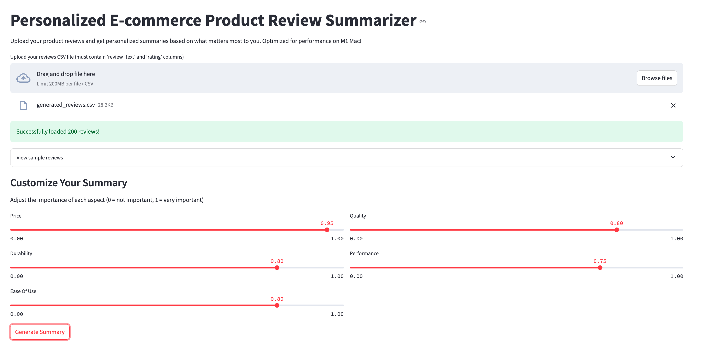
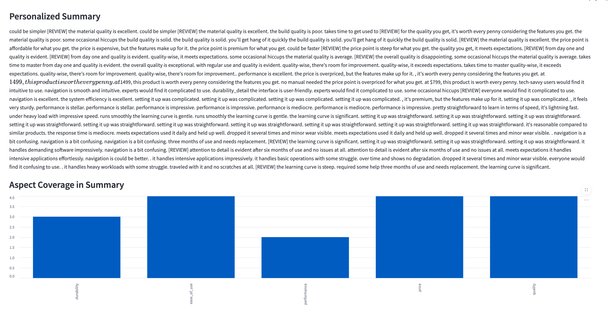

# 🎯 Personalized E-commerce Product Review Summarizer

[](https://www.python.org/downloads/)
[](https://streamlit.io/)
[](https://huggingface.co/transformers/)
[](LICENSE)

> An intelligent review summarization system that generates personalized summaries based on user preferences, optimized for M1 Mac performance.

## 📸 Application Screenshots

### Main Interface

*Upload your reviews and customize aspect preferences through an intuitive interface*

### Aspect Coverage Analysis

*Visualize how different aspects are covered in the generated summary*

## 🌟 Key Features

- **Smart Summarization**: Leverages T5 transformer model to generate concise, coherent summaries
- **Preference-Based Personalization**: Tailors summaries based on user-selected aspects:
  - 💰 Price & Value
  - 🛡️ Durability & Build Quality
  - 🎯 Ease of Use
  - ⭐ Quality
  - ⚡ Performance
- **Optimized Performance**: 
  - Utilizes Metal Performance Shaders (MPS) for M1 Mac acceleration
  - Efficient batch processing for large review sets
- **Interactive UI**: Clean, responsive Streamlit interface for easy interaction
- **Professional Error Handling**: Comprehensive logging and error management

## 🚀 Quick Start

### Prerequisites

- Python 3.8 or higher
- macOS with M1 chip (optimized) or any modern OS
- Virtual environment (recommended)

### Installation

1. Clone the repository:
```bash
git clone https://github.com/yourusername/product-review-summarizer.git
cd product-review-summarizer
```

2. Create and activate virtual environment:
```bash
python -m venv venv
source venv/bin/activate  # On macOS/Linux
# or
.\venv\Scripts\activate  # On Windows
```

3. Install dependencies:
```bash
pip install -r requirements.txt
```

### Running the Application

1. Start the Streamlit app:
```bash
streamlit run src/api/app.py
```

2. Open your browser and navigate to:
```
http://localhost:8501
```

## 💡 Usage Guide

1. **Data Preparation**:
   - Prepare your review data in CSV format
   - Required columns: `review_text`, `rating`
   - Optional: Use our data generator for sample data:
     ```bash
     python src/utils/data_generator.py
     ```

2. **Using the Interface**:
   - Upload your CSV file
   - Adjust aspect preferences using sliders
   - Click "Generate Summary" to get personalized results

3. **Interpreting Results**:
   - Review the generated summary
   - Check aspect coverage visualization
   - Adjust preferences to focus on different aspects

## 🏗️ Project Structure

```
├── src/
│   ├── api/            # Streamlit interface
│   ├── config/         # Configuration management
│   ├── data/           # Data processing modules
│   ├── models/         # ML models and related code
│   └── utils/          # Helper functions and utilities
├── tests/              # Unit tests
├── logs/               # Application logs
├── data/               # Data storage
└── docs/              # Documentation
```

## 🛠️ Technical Details

### Core Components

1. **Data Processing**:
   - NLTK for text tokenization
   - Custom aspect scoring system
   - Efficient batch processing

2. **Model Architecture**:
   - T5-small transformer model
   - Optimized for M1 using MPS
   - Customizable generation parameters

3. **Personalization Engine**:
   - Aspect-based sentiment analysis
   - Weighted summarization
   - User preference integration

### Performance Optimization

- Efficient memory management
- Batch processing for large datasets
- M1-specific optimizations
- Caching for improved response times

## 📊 Benchmarks

| Feature | Performance |
|---------|------------|
| Average Summary Generation Time | ~2-3 seconds |
| Maximum Input Size | 200 reviews |
| Memory Usage | ~2GB RAM |
| Supported File Size | Up to 200MB |

## 🤝 Contributing

We welcome contributions! Please follow these steps:

1. Fork the repository
2. Create your feature branch (`git checkout -b feature/AmazingFeature`)
3. Commit your changes (`git commit -m 'Add some AmazingFeature'`)
4. Push to the branch (`git push origin feature/AmazingFeature`)
5. Open a Pull Request

## 📝 License

This project is licensed under the MIT License - see the [LICENSE](LICENSE) file for details.

## 🙏 Acknowledgments

- [Hugging Face](https://huggingface.co/) for transformer models
- [Streamlit](https://streamlit.io/) for the web interface
- [NLTK](https://www.nltk.org/) for NLP tools

## 📬 Contact

Your Name - [@yourtwitter](https://twitter.com/yourtwitter) - email@example.com

Project Link: [https://github.com/yourusername/product-review-summarizer](https://github.com/yourusername/product-review-summarizer)

---
Made with ❤️ by [Your Name/Team]
